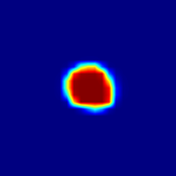
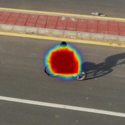
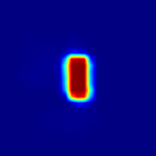
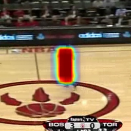

# [SiamCAR](https://openaccess.thecvf.com/content_CVPR_2020/html/Guo_SiamCAR_Siamese_Fully_Convolutional_Classification_and_Regression_for_Visual_Tracking_CVPR_2020_paper.html)

Note: Not all frames can draw a Heatmap image, which may be a bug.

<div align="center">
  
  
  
  
  <p>Example UAV123 bike1 and OTB100 Basketball.</p>
</div>

# 1. Environment setup
This code has been tested on Ubuntu 18.04, Python 3.7, Pytorch 1.7.1, CUDA 11.1.
Please install related libraries before running this code: 
```bash
pip install -r requirements.txt
cd toolkit/utils/
python setup.py build_ext --inplace
```

# 2. model
- [x] [SiamCAR](https://github.com/ohhhyeahhh/SiamCAR)

# 3. classfication heatmap
```bash 
cd /path/to/SiamCAR-CAM
conda activate SiamCAR
export PYTHONPATH=./:$PYTHONPATH
python tools/CAM-demo.py                                \
	--dataset_dir  /path/to/dataset/root            \ # dataset path
	--dataset UAV123                                \ # dataset name(OTB100, GOT-10k, LaSOT, UAV123)
	--snapshot snapshot/general_model.pth           \ # tracker_name
	--format bmp                                    \ # save fomat (pdf,png,jpg,bmp)   
	--CAM_name GroupCAM                             \ # CAM_name (GroupCAM, GradCAM, GradCAMpp, SmoothGradCAM, ScoreCAM)  
	--save_dir /path/to/save                        \ # save dir
	--config ./experiments/siamcar_r50/config.yaml  \ # config file
	--register_layer softmax                        \ # module register name
```

# 4. Hyperparametric search
```bash 
cd /path/to/SiamCAR-CAM
conda activate SiamCAR
export PYTHONPATH=./:$PYTHONPATH
python tools/tune.py                                \
	--dataset_dir  /path/to/dataset/root            \ # dataset path
	--dataset UAV123                                \ # dataset name(OTB100, LaSOText, LaSOT, UAV123, VOT2016, VOT2018, VOT2019)
	--snapshot snapshot/general_model.pth           \ # tracker_name
	--config ./experiments/siamcar_r50/config.yaml  \ # config file
```
# 5. Update
## 2022.02.15 update
1.Fixed errors in image normalization due to different versions of torchvision.
  
2.Fix the UnNormalize dimension error.
## 2022.03.05 update
1.Fixed an error caused by the addition of tensor and numpy data in the show_cam function due to version problems
  
## 2022.05.17 update
1.Fixed a problem with missing "time.txt" files during GOT10k testing.
  
## 2022.05.29 update
1.Add SiamCAR hyperparameter search code.
  
## 2022.06.09 update
1.The code supports the drawing of multiple CAM

2.Add Rise visualization code

## 2022.11.14 update
Fix bug in parameter search

## 2022.11.20 update
Fixed the issue that parameters could not be searched under GOT-10k
